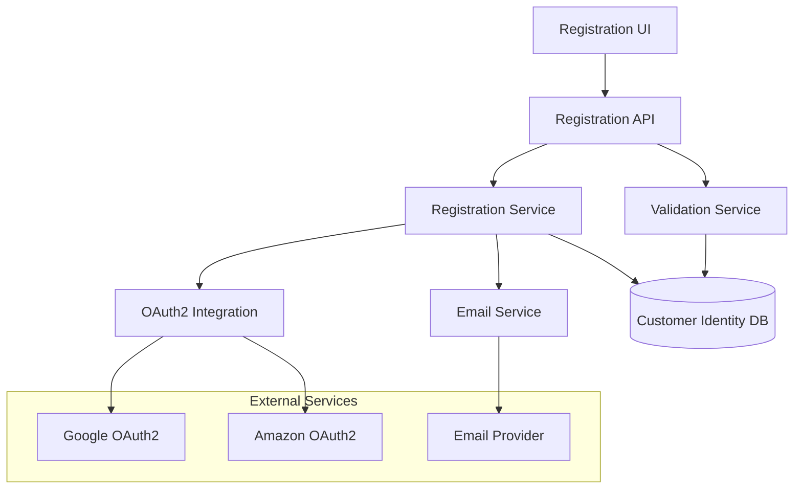
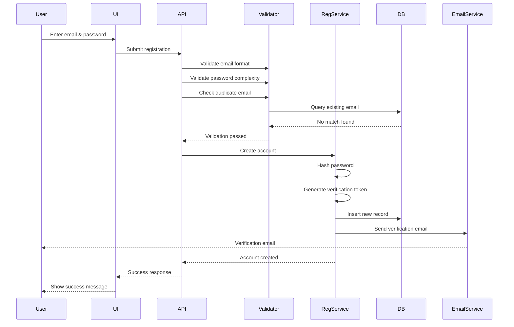
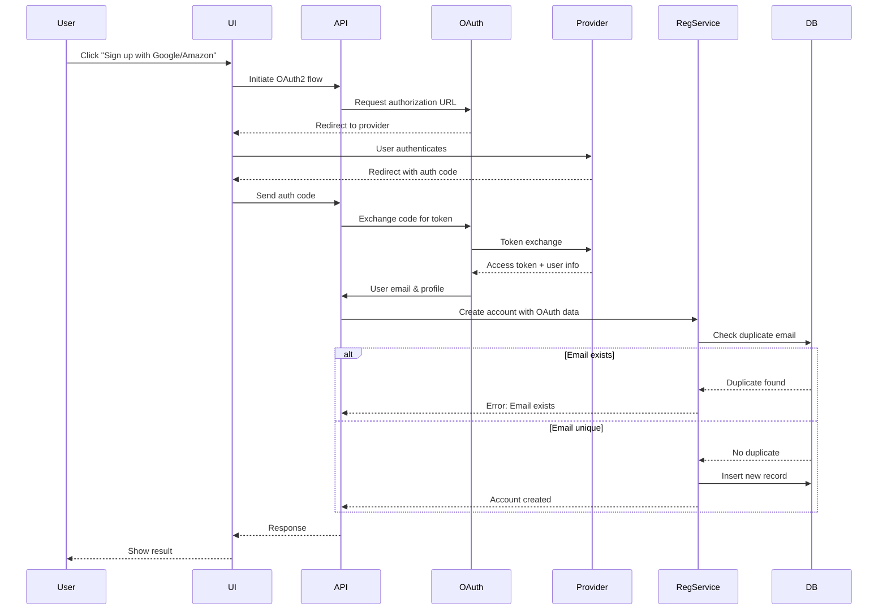

# Design Document: User Registration

## Overview

The User Registration system provides secure account creation through two methods: email/password registration and OAuth2 social login (Google and Amazon). The system ensures data integrity through duplicate prevention, enforces password complexity standards, and requires email verification for email/password registrations.

The design follows a layered architecture with clear separation between:
- **Presentation Layer**: Registration forms and user interface
- **Application Layer**: Registration logic, validation, and orchestration
- **Integration Layer**: OAuth2 provider communication
- **Data Layer**: Customer identity storage and retrieval
- **Communication Layer**: Email verification service

## Architecture

### High-Level Architecture



### Registration Flow

**Email/Password Registration Flow:**


**OAuth2 Social Login Flow:**


## Components and Interfaces

### 1. Registration API

**Responsibilities:**
- Expose HTTP endpoints for registration operations
- Coordinate validation and registration services
- Handle request/response transformation
- Manage error responses

**Endpoints:**

```
POST /api/v1/register/email
Request:
{
  "email": "string",
  "password": "string",
  "firstName": "string",
  "lastName": "string"
}
Response (Success - 201):
{
  "userId": "string",
  "email": "string",
  "verified": false,
  "message": "Registration successful. Please check your email for verification."
}
Response (Error - 400):
{
  "error": "string",
  "details": ["string"]
}

POST /api/v1/register/oauth/initiate
Request:
{
  "provider": "google" | "amazon",
  "redirectUri": "string"
}
Response (200):
{
  "authorizationUrl": "string",
  "state": "string"
}

POST /api/v1/register/oauth/callback
Request:
{
  "provider": "google" | "amazon",
  "code": "string",
  "state": "string"
}
Response (Success - 201):
{
  "userId": "string",
  "email": "string",
  "verified": true,
  "provider": "string"
}

GET /api/v1/register/verify
Query Parameters:
  - token: string
Response (Success - 200):
{
  "message": "Email verified successfully"
}
Response (Error - 400):
{
  "error": "Invalid or expired verification token"
}
```

### 2. Validation Service

**Responsibilities:**
- Validate email format (RFC 5322 compliance)
- Validate password complexity
- Check for duplicate emails (case-insensitive)
- Provide validation error messages

**Interface:**

```typescript
interface ValidationService {
  validateEmail(email: string): ValidationResult
  validatePassword(password: string): ValidationResult
  checkDuplicateEmail(email: string): Promise<boolean>
  validateRegistrationRequest(request: RegistrationRequest): Promise<ValidationResult>
}

interface ValidationResult {
  isValid: boolean
  errors: string[]
}

interface RegistrationRequest {
  email: string
  password?: string
  firstName: string
  lastName: string
}
```

**Password Complexity Rules:**
- Minimum 8 characters
- At least 1 special character (!@#$%^&*()_+-=[]{}|;:,.<>?)
- At least 1 number (0-9)

**Email Validation:**
- Must conform to RFC 5322 format
- Case-insensitive duplicate checking

### 3. Registration Service

**Responsibilities:**
- Orchestrate account creation process
- Hash passwords securely
- Generate verification tokens
- Store user records in database
- Trigger email verification
- Handle OAuth2 account creation

**Interface:**

```typescript
interface RegistrationService {
  registerWithEmail(request: EmailRegistrationRequest): Promise<RegistrationResult>
  registerWithOAuth(oauthData: OAuthUserData): Promise<RegistrationResult>
  verifyEmail(token: string): Promise<VerificationResult>
}

interface EmailRegistrationRequest {
  email: string
  password: string
  firstName: string
  lastName: string
}

interface OAuthUserData {
  provider: 'google' | 'amazon'
  email: string
  firstName: string
  lastName: string
  providerId: string
  accessToken: string
}

interface RegistrationResult {
  success: boolean
  userId?: string
  error?: string
}

interface VerificationResult {
  success: boolean
  error?: string
}
```

**Password Hashing:**
- Use bcrypt with cost factor of 12
- Salt is automatically generated per password
- Never store plain text passwords

**Verification Token:**
- Generate cryptographically secure random token (32 bytes)
- Store token hash in database
- Set expiration time (24 hours)

### 4. OAuth2 Integration Service

**Responsibilities:**
- Generate OAuth2 authorization URLs
- Handle OAuth2 callback and token exchange
- Retrieve user profile information from providers
- Support Google and Amazon OAuth2 flows

**Interface:**

```typescript
interface OAuth2Service {
  getAuthorizationUrl(provider: OAuthProvider, redirectUri: string): AuthorizationUrlResult
  exchangeCodeForToken(provider: OAuthProvider, code: string, state: string): Promise<TokenResult>
  getUserInfo(provider: OAuthProvider, accessToken: string): Promise<OAuthUserData>
}

type OAuthProvider = 'google' | 'amazon'

interface AuthorizationUrlResult {
  url: string
  state: string
}

interface TokenResult {
  accessToken: string
  refreshToken?: string
  expiresIn: number
}
```

**OAuth2 Configuration:**
- Google: Use Google Identity Platform OAuth2
- Amazon: Use Login with Amazon OAuth2
- Store client IDs and secrets in secure configuration
- Use PKCE (Proof Key for Code Exchange) for enhanced security

### 5. Email Service

**Responsibilities:**
- Send verification emails
- Generate email content from templates
- Handle email delivery failures
- Track email delivery status

**Interface:**

```typescript
interface EmailService {
  sendVerificationEmail(email: string, token: string, userName: string): Promise<EmailResult>
  sendWelcomeEmail(email: string, userName: string): Promise<EmailResult>
}

interface EmailResult {
  success: boolean
  messageId?: string
  error?: string
}
```

**Email Template (Verification):**
```
Subject: Verify your email address

Hi {firstName},

Thank you for registering! Please verify your email address by clicking the link below:

{verificationUrl}

This link will expire in 24 hours.

If you didn't create an account, please ignore this email.

Best regards,
The Team
```

### 6. Data Layer

**Customer Identity Table Schema:**

```sql
CREATE TABLE customer_identity (
  user_id UUID PRIMARY KEY DEFAULT gen_random_uuid(),
  email VARCHAR(255) UNIQUE NOT NULL,
  email_normalized VARCHAR(255) UNIQUE NOT NULL, -- lowercase for duplicate checking
  password_hash VARCHAR(255), -- NULL for OAuth users
  first_name VARCHAR(100) NOT NULL,
  last_name VARCHAR(100) NOT NULL,
  registration_method VARCHAR(20) NOT NULL, -- 'email' or 'oauth'
  oauth_provider VARCHAR(20), -- 'google', 'amazon', or NULL
  oauth_provider_id VARCHAR(255), -- Provider's user ID
  oauth_token_encrypted TEXT, -- Encrypted OAuth token
  email_verified BOOLEAN DEFAULT FALSE,
  verification_token_hash VARCHAR(255),
  verification_token_expires_at TIMESTAMP,
  created_at TIMESTAMP DEFAULT CURRENT_TIMESTAMP,
  updated_at TIMESTAMP DEFAULT CURRENT_TIMESTAMP,
  last_login_at TIMESTAMP,
  
  CONSTRAINT check_registration_method CHECK (registration_method IN ('email', 'oauth')),
  CONSTRAINT check_oauth_provider CHECK (
    (registration_method = 'oauth' AND oauth_provider IS NOT NULL) OR
    (registration_method = 'email' AND oauth_provider IS NULL)
  ),
  CONSTRAINT check_password_hash CHECK (
    (registration_method = 'email' AND password_hash IS NOT NULL) OR
    (registration_method = 'oauth' AND password_hash IS NULL)
  )
);

CREATE INDEX idx_email_normalized ON customer_identity(email_normalized);
CREATE INDEX idx_oauth_provider_id ON customer_identity(oauth_provider, oauth_provider_id);
CREATE INDEX idx_verification_token ON customer_identity(verification_token_hash) WHERE email_verified = FALSE;
```

**Repository Interface:**

```typescript
interface CustomerIdentityRepository {
  create(customer: CustomerIdentity): Promise<string> // returns userId
  findByEmail(email: string): Promise<CustomerIdentity | null>
  findByOAuthProvider(provider: string, providerId: string): Promise<CustomerIdentity | null>
  findByVerificationToken(tokenHash: string): Promise<CustomerIdentity | null>
  updateEmailVerified(userId: string): Promise<void>
  updateLastLogin(userId: string): Promise<void>
}

interface CustomerIdentity {
  userId?: string
  email: string
  emailNormalized: string
  passwordHash?: string
  firstName: string
  lastName: string
  registrationMethod: 'email' | 'oauth'
  oauthProvider?: 'google' | 'amazon'
  oauthProviderId?: string
  oauthTokenEncrypted?: string
  emailVerified: boolean
  verificationTokenHash?: string
  verificationTokenExpiresAt?: Date
  createdAt?: Date
  updatedAt?: Date
  lastLoginAt?: Date
}
```

## Data Models

### Core Domain Models

**User Registration Request (Email/Password):**
```typescript
interface EmailRegistrationRequest {
  email: string          // Valid email format, unique
  password: string       // Meets complexity requirements
  firstName: string      // 1-100 characters
  lastName: string       // 1-100 characters
}
```

**User Registration Request (OAuth):**
```typescript
interface OAuthRegistrationData {
  provider: 'google' | 'amazon'
  email: string
  firstName: string
  lastName: string
  providerId: string     // Provider's unique user identifier
  accessToken: string    // OAuth access token (will be encrypted)
}
```

**Verification Token:**
```typescript
interface VerificationToken {
  token: string          // 32-byte random token (hex encoded)
  tokenHash: string      // SHA-256 hash of token
  expiresAt: Date        // 24 hours from creation
  userId: string         // Associated user ID
}
```

**Password Complexity Validation:**
```typescript
interface PasswordRequirements {
  minLength: 8
  requireSpecialChar: true
  requireNumber: true
  specialChars: '!@#$%^&*()_+-=[]{}|;:,.<>?'
}
```

### Data Flow

**Email/Password Registration:**
1. User submits email + password
2. Validation Service validates format and complexity
3. Validation Service checks for duplicate email (case-insensitive)
4. Registration Service hashes password with bcrypt
5. Registration Service generates verification token
6. Registration Service stores record in Customer_Identity_Table
7. Email Service sends verification email
8. User clicks verification link
9. Registration Service validates token and marks email as verified

**OAuth Registration:**
1. User initiates OAuth flow
2. OAuth2 Service redirects to provider
3. Provider authenticates user
4. Provider redirects back with authorization code
5. OAuth2 Service exchanges code for access token
6. OAuth2 Service retrieves user profile
7. Registration Service checks for duplicate email
8. Registration Service encrypts and stores OAuth token
9. Registration Service creates account (pre-verified)

## Data Models

### Security Considerations

**Password Storage:**
- Use bcrypt with cost factor 12
- Automatic salt generation
- Never log or transmit plain text passwords

**OAuth Token Storage:**
- Encrypt tokens using AES-256-GCM
- Store encryption key in secure key management service
- Rotate encryption keys periodically

**Verification Tokens:**
- Use cryptographically secure random generation
- Store only hashed tokens in database
- Implement token expiration (24 hours)

**Transport Security:**
- All API endpoints must use HTTPS/TLS 1.2+
- Implement HSTS headers
- Use secure cookies for session management

**Input Sanitization:**
- Sanitize all user inputs to prevent injection attacks
- Use parameterized queries for database operations
- Validate and escape email addresses


## Correctness Properties

*A property is a characteristic or behavior that should hold true across all valid executions of a system—essentially, a formal statement about what the system should do. Properties serve as the bridge between human-readable specifications and machine-verifiable correctness guarantees.*

### Registration Properties

**Property 1: Valid email registration creates database record**

*For any* unique email and valid password, when a user submits a registration request, the system should create a new record in the Customer_Identity_Table with the correct email, hashed password, and user details.

**Validates: Requirements 1.1**

**Property 2: Valid email registration triggers verification email**

*For any* unique email and valid password, when a user submits a registration request, the system should send a verification email to the provided email address.

**Validates: Requirements 1.2**

**Property 3: Password validation enforces complexity requirements**

*For any* password string, the validation result should correctly reflect whether it meets all complexity requirements (minimum 8 characters, at least 1 special character, at least 1 number), and invalid passwords should be rejected with descriptive error messages.

**Validates: Requirements 1.3, 1.4**

**Property 4: Case-insensitive duplicate email prevention**

*For any* email address, if an account exists with that email (in any case variation), then attempting to register with the same email in a different case should be rejected with an error indicating the email is already registered.

**Validates: Requirements 1.5, 4.1**

### OAuth Registration Properties

**Property 5: OAuth registration with unique email creates account**

*For any* OAuth provider (Google or Amazon) and unique email, when the system receives successful OAuth authentication data, it should create a new record in the Customer_Identity_Table with the OAuth provider information and mark the email as verified.

**Validates: Requirements 2.4**

**Property 6: Cross-method duplicate prevention**

*For any* email address, if an account exists via one registration method (email/password or OAuth), then attempting to register with the same email via any other method should be rejected.

**Validates: Requirements 2.5, 4.2**

**Property 7: Duplicate rejection error consistency**

*For any* duplicate email registration attempt, the error message should not reveal whether the existing account was created via email/password or OAuth.

**Validates: Requirements 4.3**

**Property 8: OAuth callback extracts user data**

*For any* valid OAuth provider response, the system should correctly extract and store the user's email, first name, last name, and provider ID.

**Validates: Requirements 2.3**

### Email Verification Properties

**Property 9: Verification token generation and email delivery**

*For any* email/password registration, the system should generate a unique verification token, store its hash in the database, and include the token in the verification email sent to the user.

**Validates: Requirements 3.1, 3.2**

**Property 10: Valid token verification**

*For any* valid, non-expired verification token, when a user submits it for verification, the system should mark the associated account as verified in the Customer_Identity_Table.

**Validates: Requirements 3.3**

**Property 11: Invalid token rejection**

*For any* invalid or expired verification token, when a user submits it for verification, the system should reject it and return an error message without modifying the account status.

**Validates: Requirements 3.4**

**Property 12: Unverified account access restriction**

*For any* unverified account, attempts to access protected services should be denied until the email is verified.

**Validates: Requirements 3.5**

### Security Properties

**Property 13: Password hashing**

*For any* password stored in the Customer_Identity_Table, the stored value should be a valid bcrypt hash (not plain text) with appropriate cost factor.

**Validates: Requirements 5.1, 5.2**

**Property 14: OAuth token encryption**

*For any* OAuth token stored in the Customer_Identity_Table, the stored value should be encrypted (not plain text).

**Validates: Requirements 5.4**

**Property 15: Sensitive data exclusion from logs**

*For any* registration event logged by the system, the log message should not contain passwords, OAuth tokens, or other sensitive credentials.

**Validates: Requirements 5.5**

### Validation Properties

**Property 16: Email format validation**

*For any* email string, the validation should correctly identify whether it conforms to RFC 5322 format, and invalid emails should be rejected with appropriate error messages.

**Validates: Requirements 6.1, 6.2**

## Error Handling

### Error Categories

**Validation Errors (400 Bad Request):**
- Invalid email format
- Password complexity requirements not met
- Missing required fields
- Email already registered (duplicate)

**Authentication Errors (401 Unauthorized):**
- Invalid verification token
- Expired verification token
- OAuth authentication failed

**Server Errors (500 Internal Server Error):**
- Database connection failure
- Email service unavailable
- OAuth provider communication failure
- Encryption/hashing service failure

### Error Response Format

All errors follow a consistent format:

```json
{
  "error": "Brief error description",
  "code": "ERROR_CODE",
  "details": ["Detailed error message 1", "Detailed error message 2"],
  "timestamp": "2024-01-15T10:30:00Z"
}
```

### Error Handling Strategies

**Validation Errors:**
- Return immediately with descriptive messages
- Include all validation failures in single response
- Preserve user input (except passwords) for correction

**Duplicate Email:**
- Use consistent error message regardless of registration method
- Do not reveal whether email exists or registration method used
- Log attempt for security monitoring

**OAuth Failures:**
- Provide user-friendly error messages
- Log detailed error for debugging
- Offer retry mechanism
- Fall back to email/password registration option

**Email Service Failures:**
- Create account but mark as pending verification
- Queue email for retry
- Log failure for monitoring
- Provide user with manual verification option

**Database Failures:**
- Return generic error to user
- Log detailed error for investigation
- Implement retry logic with exponential backoff
- Ensure no partial data is committed

**Token Expiration:**
- Provide clear expiration message
- Offer option to resend verification email
- Generate new token for resend

### Idempotency

**Registration Requests:**
- Duplicate registration attempts with same email return same error
- Verification token clicks are idempotent (already verified accounts return success)
- OAuth callback handling prevents duplicate account creation

## Testing Strategy

### Dual Testing Approach

The testing strategy employs both unit tests and property-based tests to ensure comprehensive coverage:

- **Unit tests**: Verify specific examples, edge cases, and error conditions
- **Property-based tests**: Verify universal properties across all inputs
- Both approaches are complementary and necessary for comprehensive validation

### Property-Based Testing

**Framework Selection:**
- **TypeScript/JavaScript**: Use `fast-check` library
- **Python**: Use `hypothesis` library
- **Java**: Use `jqwik` library

**Configuration:**
- Minimum 100 iterations per property test
- Each test must reference its design document property
- Tag format: `Feature: user-registration, Property {number}: {property_text}`

**Property Test Coverage:**

Each correctness property listed above must be implemented as a property-based test:

1. Property 1: Generate random unique emails and valid passwords, verify database record creation
2. Property 2: Generate random registration data, verify email service invocation
3. Property 3: Generate random passwords (valid and invalid), verify validation logic
4. Property 4: Generate random email case variations, verify duplicate rejection
5. Property 5: Generate random OAuth user data, verify account creation
6. Property 6: Generate random cross-method registration attempts, verify rejection
7. Property 7: Generate random duplicate attempts, verify error message consistency
8. Property 8: Generate random OAuth responses, verify data extraction
9. Property 9: Generate random registrations, verify token generation and email content
10. Property 10: Generate random valid tokens, verify verification success
11. Property 11: Generate random invalid/expired tokens, verify rejection
12. Property 12: Generate random unverified accounts, verify access denial
13. Property 13: Generate random passwords, verify bcrypt hash storage
14. Property 14: Generate random OAuth tokens, verify encryption
15. Property 15: Generate random registration events, verify log sanitization
16. Property 16: Generate random email strings, verify RFC 5322 validation

### Unit Testing

**Focus Areas:**
- Specific examples demonstrating correct behavior
- Edge cases (empty strings, boundary values, special characters)
- Error conditions (network failures, database errors)
- Integration points between components

**Unit Test Coverage:**

**Validation Service:**
- Test specific invalid email formats (missing @, invalid domain, etc.)
- Test password complexity edge cases (exactly 8 chars, only special chars, etc.)
- Test empty field validation
- Test SQL injection attempts in email field

**Registration Service:**
- Test successful email registration flow
- Test successful OAuth registration flow
- Test duplicate email rejection
- Test verification token generation uniqueness
- Test token expiration handling

**OAuth2 Integration:**
- Test Google OAuth flow with mock responses
- Test Amazon OAuth flow with mock responses
- Test OAuth error handling (denied access, network failure)
- Test token exchange failures

**Email Service:**
- Test verification email content generation
- Test email delivery failure handling
- Test email template rendering

**Repository Layer:**
- Test CRUD operations on Customer_Identity_Table
- Test case-insensitive email queries
- Test transaction rollback on errors
- Test concurrent registration attempts

### Integration Testing

**End-to-End Flows:**
- Complete email/password registration and verification flow
- Complete OAuth registration flow (Google and Amazon)
- Duplicate prevention across methods
- Error handling and recovery

**External Service Integration:**
- OAuth provider integration (use test/sandbox environments)
- Email service integration (use test email addresses)
- Database integration (use test database)

### Security Testing

**Penetration Testing:**
- SQL injection attempts
- XSS attempts in registration fields
- CSRF protection validation
- Rate limiting verification

**Password Security:**
- Verify bcrypt cost factor
- Verify password not logged or transmitted in plain text
- Verify password hash uniqueness (different salts)

**OAuth Security:**
- Verify state parameter validation (CSRF protection)
- Verify token encryption
- Verify secure token storage

### Performance Testing

**Load Testing:**
- Concurrent registration requests (target: 100 req/sec)
- Database connection pool under load
- Email queue performance

**Stress Testing:**
- Maximum concurrent users
- Database failure recovery
- Email service degradation handling

### Test Data Generation

**Property-Based Test Generators:**

```typescript
// Email generator
const emailGen = fc.tuple(
  fc.stringOf(fc.char().filter(c => /[a-zA-Z0-9._-]/.test(c)), {minLength: 1, maxLength: 64}),
  fc.constantFrom('gmail.com', 'yahoo.com', 'example.com', 'test.org')
).map(([local, domain]) => `${local}@${domain}`)

// Valid password generator
const validPasswordGen = fc.tuple(
  fc.stringOf(fc.char(), {minLength: 8, maxLength: 20}),
  fc.constantFrom('!', '@', '#', '$', '%'),
  fc.integer({min: 0, max: 9})
).map(([base, special, num]) => base + special + num)

// Invalid password generator (missing requirements)
const invalidPasswordGen = fc.oneof(
  fc.string({maxLength: 7}), // too short
  fc.stringOf(fc.char().filter(c => /[a-zA-Z]/.test(c)), {minLength: 8}), // no special or number
  fc.stringOf(fc.char().filter(c => /[a-zA-Z!@#$%]/.test(c)), {minLength: 8}) // no number
)

// OAuth user data generator
const oauthUserGen = fc.record({
  provider: fc.constantFrom('google', 'amazon'),
  email: emailGen,
  firstName: fc.string({minLength: 1, maxLength: 50}),
  lastName: fc.string({minLength: 1, maxLength: 50}),
  providerId: fc.uuid(),
  accessToken: fc.uuid()
})
```

### Continuous Integration

**CI Pipeline:**
1. Run unit tests on every commit
2. Run property-based tests on every commit
3. Run integration tests on pull requests
4. Run security scans on pull requests
5. Run performance tests on main branch

**Test Reporting:**
- Code coverage target: 85% minimum
- Property test failure analysis
- Performance regression detection
- Security vulnerability reporting
